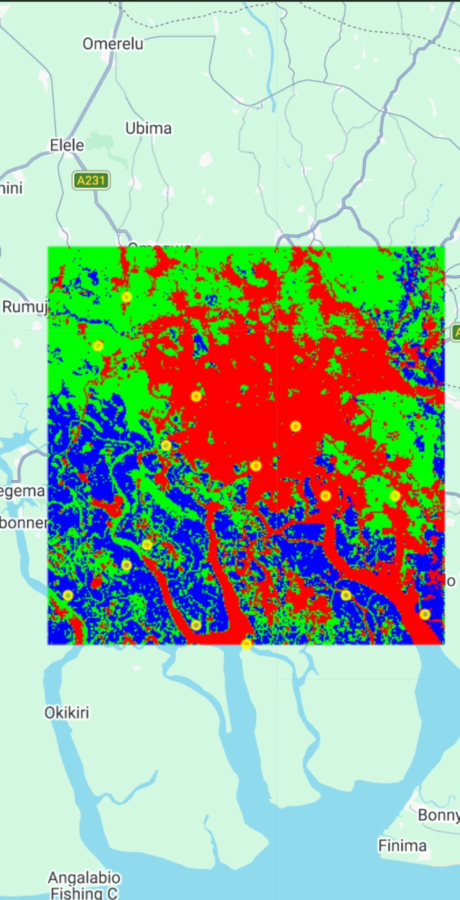

# Divine Amesi | Remote Sensing & GIS Portfolio

Entry-level Geospatial Analyst | Port Harcourt, Nigeria

## Project 1: Sentinel-2 Land Cover Classification
**Tools**: Google Earth Engine, Random Forest  
**What**: Classified Water, Vegetation, Built-up, Bare Soil  
**Result**: 85% Accuracy, Kappa 0.81  
**Code**: `landcover_script.js`  
**Map**: 

**Contact**: your.email@gmail.com
